# Git - 分布式版本控制工具

## 1、目标

- 了解Git基本概念
- 能够概述Git工作流程
- 能够使用Git常用命令
- 熟悉Git代码托管服务
- 能够使用IDEA操作Git

## 2、概述

### 2.1、开发中的实际场景

```
场景一：备份
	小明负责的模块就要完成了，就在即将Release之前的一瞬间，电脑突然蓝屏，硬盘光荣牺牲！几个月来的努力付之东流
	
场景二：代码还原
	这个项目中需要一个很复杂的功能，老王摸索了一个星期终于有眉目了，可是这被改得面目全非的代码已经回不到从前了。什么地方能买到哆啦A梦的时光机啊？
	
场景三：协同开发
	小刚和小强先后从文件服务器上下载了同一个文件：Analysis.java。小刚在Analysis.java文件中的第30行声明了一个方法，叫count()，先保存到了文件服务器上；小强在Analysis.java文件中的第50行声明了一个方法，叫sum()，也随后保存到了文件服务器上，于是，count()方法就只存在于小刚的记忆中了
	
场景四：追溯问题代码的编写人和编写时间！
	老王是另一位项目经理，每次因为项目进度挨骂之后，他都不知道该扣哪个程序员的工资！就拿这次来说吧，有个Bug调试了30多个小时才知道是因为相关属性没有在应用初始化时赋值！可是二胖、王东、刘流和正经牛都不承认是自己干的！
```
### 2.2、版本控制器的方式

```
a、集中式版本控制工具
	集中式版本控制工具，版本库是集中存放在中央服务器的，team里每个人work时从中央服务器下载代码，是必须联网才能工作，局域网或互联网。个人修改后然后提交到中央版本库。
	举例：SVN和CVS
b、分布式版本控制工具
	分布式版本控制系统没有“中央服务器”，每个人的电脑上都是一个完整的版本库，这样工作的时候，无需要联网了，因为版本库就在你自己的电脑上。多人协作只需要各自的修改推送给对方，就能互相看到对方的修改了。
	举例：Git
```
### 2.3、SVN

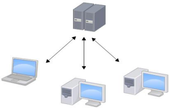

### 2.4、Git

```
	Git是分布式的,Git不需要有中心服务器，我们每台电脑拥有的东西都是一样的。我们使用Git并且有个中心服务器，仅仅是为了方便交换大家的修改，但是这个服务器的地位和我们每个人的PC是一样的。我们可以把它当做一个开发者的pc就可以就是为了大家代码容易交流不关机用的。没有它大家一样可以工作，只不过“交换”修改不方便而已。
	git是一个开源的分布式版本控制系统，可以有效、高速地处理从很小到非常大的项目版本管理。Git是Linus Torvalds 为了帮助管理 Linux 内核开发而开发的一个开放源码的版本控制软件。
	同生活中的许多伟大事物一样，Git 诞生于一个极富纷争大举创新的年代。Linux 内核开源项目有着为数众多的参与者。 绝大多数的 Linux 内核维护工作都花在了提交补丁和保存归档的繁琐事务上（1991－2002年间）。 到 2002 年，整个项目组开始启用一个专有的分布式版本控制系统 BitKeeper 来管理和维护代码。
	到了 2005 年，开发 BitKeeper 的商业公司同 Linux 内核开源社区的合作关系结束，他们收回了Linux 内核社区免费使用 BitKeeper 的权力。 这就迫使 Linux 开源社区（特别是 Linux 的缔造者Linus Torvalds）基于使用 BitKeeper 时的经验教训，开发出自己的版本系统。 他们对新的系统制订了若干目标：
  速度
  简单的设计
  对非线性开发模式的强力支持（允许成千上万个并行开发的分支）
  完全分布式
  有能力高效管理类似 Linux 内核一样的超大规模项目（速度和数据量）
```

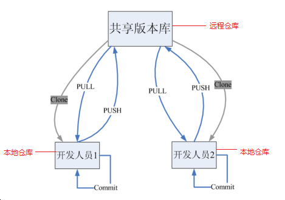

### 2.5、Git工作流程图

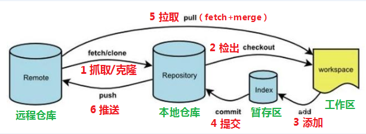

命令如下：

1. clone（克隆）: 从远程仓库中克隆代码到本地仓库
2. checkout （检出）:从本地仓库中检出一个仓库分支然后进行修订
3. add（添加）: 在提交前先将代码提交到暂存区
4. commit（提交）: 提交到本地仓库。本地仓库中保存修改的各个历史版本
5. fetch (抓取) ： 从远程库，抓取到本地仓库，不进行任何的合并动作，一般操作比较少。
6. pull (拉取) ： 从远程库拉到本地库，自动进行合并(merge)，然后放到到工作区，相当于fetch+merge
7. push（推送） : 修改完成后，需要和团队成员共享代码时，将代码推送到远程仓库

## 3、Git安装与常用命令

本教程里的git命令例子都是在Git Bash中演示的，会用到一些基本的linux命令，在此为大家提前列举：

- `ls`/`ll` 查看当前目录
- `cat` 查看文件内容
- `touch` 创建文件
- `vi` vi编辑器（使用vi编辑器是为了方便展示效果，学员可以记事本、EditPlus、NotePad++等其它编辑器）

### 3.1、 Git环境配置

#### 3.1.1 下载与安装

下载地址： https://git-scm.com/download

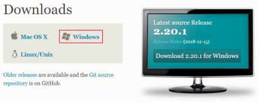

下载完成后可以得到如下安装文件：


双击下载的安装文件来安装Git。安装完成后在电脑桌面（也可以是其他目录)点击右键，如果能够看到如下两个菜单则说明Git安装成功。

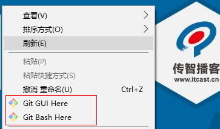

备注：

Git GUI：Git提供的图形界面工具

Git Bash：Git提供的命令行工具

当安装Git后首先要做的事情是设置用户名称和email地址。这是非常重要的，因为每次Git提交都会使用该用户信息

#### 3.1.2基本配置

1. 打开Git Bash
2. 设置用户信息
    `git config --global user.name “itcast”`
    `git config --global user.email “hello@itcast.cn”`

查看配置信息
`git config --global user.name`
`git config --global user.email`

#### 3.1.3 为常用指令配置别名（可选）

有些常用的指令参数非常多，每次都要输入好多参数，我们可以使用别名。
1. 打开用户目录，创建`.bashrc`文件
    部分windows系统不允许用户创建点号开头的文件，可以打开gitBash,执行`touch ~/.bashrc`
    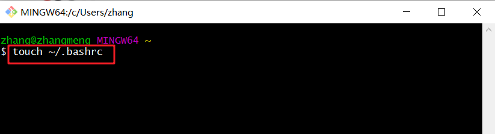
2. 在`.bashrc`文件中输入如下内容：
   ```shell
   #用于输出git提交日志
   alias git-log='git log --pretty=oneline --all --graph --abbrev-commit'
   #用于输出当前目录所有文件及基本信息
   alias ll='ls -al'
   #用于一次性暂存并提交所有修改和删除的文件
   alias commit='git commit -a'
   ```
3. 打开gitBash，执行`source ~/.bashrc`
   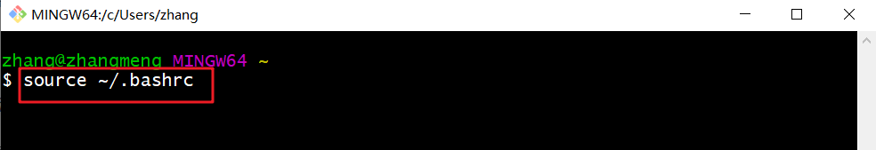

#### 3.1.4 解决GitBash乱码问题

1. 打开GitBash执行下面命令
   ```shell
   git config --global core.quotepath false
   ```

2. `${git_home}/etc/bash.bashrc`文件最后加入下面两行

   ```shell
   export LANG="zh_CN.UTF-8"
   export LC_ALL="zh_CN.UTF-8"
   ```

### 3.2、获取本地仓库

要使用Git对我们的代码进行版本控制，首先需要获得本地仓库
1）在电脑的任意位置创建一个空目录（例如test）作为我们的本地Git仓库
2）进入这个目录中，点击右键打开Git bash窗口
3）执行命令`git init`
4）如果创建成功后可在文件夹下看到隐藏的.git目录。

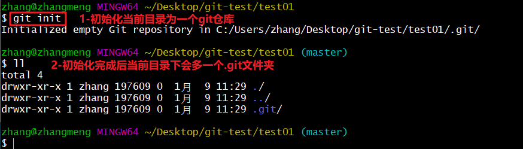

### 3.3、基础操作指令

Git工作目录下对于文件的**修改**（增加、删除、更新）会存在几个状态，这些修改的状态会随着我们执行Git的命令而发生变化。


本章节主要讲解如何使用命令来控制这些状态之间的转换：

1. git add (工作区 --> 暂存区)
2. git commit (暂存区 --> 本地仓库)

#### 3.3.1、*查看修改的状态(status)

- 作用：查看的修改的状态（暂存区、工作区）
- 命令形式：`git status`

#### 3.3.2、*添加工作区到暂存区(add)

- 作用：添加工作区一个或多个文件的修改到暂存区
- 命令形式：`git add 单个文件名|通配符`
  - 将所有修改加入暂存区：`git add .`

#### 3.3.3、*提交暂存区到本地仓库(commit)

- 作用：提交暂存区内容到本地仓库的当前分支
- 命令形式：`git commit -m '注释内容'`

#### commit

- 命令形式：`git commit [options]`
  - options
    - `-a` = `--all` 
      automatically stage files that have been **modified and deleted**.
      （新创建的文件仍需`git add`）


#### 3.3.4、*查看提交日志(log)

**在[3.1.3](#3.1.3 为常用指令配置别名（可选）)中配置的别名`git-log`就包含了这些参数，所以后续可以直接使用指令`git-log`**

- 作用:查看提交记录
- 命令形式：`git log [option]`
  - options
    - `--all` 显示所有分支
    - `--pretty=oneline` 将提交信息显示为一行
    - `--abbrev-commit` 使得输出的commitID更简短
    - `--graph` 以图的形式显示

#### 3.3.5、版本回退

- 作用：版本切换
- 命令形式：`git reset --hard commitID`
  - commitID 可以使用`git-log`或`git log`指令查看
- 如何查看已经删除的记录？
  - `git reflog`
  - 这个指令可以看到已经删除的提交记录

#### 3.3.6、添加文件至忽略列表

一般我们总会有些文件无需纳入Git 的管理，也不希望它们总出现在未跟踪文件列表。 通常都是些自动生成的文件，比如日志文件，或者编译过程中创建的临时文件等。 在这种情况下，我们可以在工作目录中创建一个名为` .gitignore`的文件（文件名称固定），列出要忽略的文件模式。下面是一个示例：

```shell
# no .a files
*.a
# but do track lib.a, even though you're ignoring .a files above
!lib.a
# only ignore the 'TODO' file in the current directory, not subdir/TODO
/TODO
# ignore all files in the 'build/' directory
build/
# ignore doc/notes.txt, but not doc/server/arch.txt
doc/*.txt
# ignore all .pdf files in the doc/ directory
doc/**/*.pdf
```
#### 练习:基础操作

```shell
#####################仓库初始化######################
# 创建目录（git_test01）并在目录下打开gitbash
略
# 初始化git仓库
git init

#####################创建文件并提交#####################
# 目录下创建文件 file01.txt
略
# 将修改加入暂存区
git add .
# 将修改提交到本地仓库，提交记录内容为：commit 001
git commit -m 'commit 001'
# 查看日志
git log

####################修改文件并提交######################
# 修改file01的内容为：count=1
略
# 将修改加入暂存区
git add .
# # 将修改提交到本地仓库，提交记录内容为：update file01
git commit -m 'update file01'
# 查看日志
git log
# 以精简的方式显示提交记录
git-log

####################将最后一次修改还原##################
# 查看提交记录
git-log
# 找到倒数第2次提交的commitID
略
# 版本回退
git reset commitID --hard
```
### 3.4、分支

几乎所有的版本控制系统都以某种形式支持分支。 使用分支意味着你可以把你的工作从开发主线上分离开来进行重大的Bug修改、开发新的功能，以免影响开发主线。

#### 3.4.1、查看本地分支

- 命令：`git branch`

#### 3.4.2、创建本地分支

- 命令：`git branch 分支名`

#### 3.4.4、*切换分支(checkout)

- 命令：`git checkout 分支名`

我们还可以直接切换到一个不存在的分支（创建并切换）

- 命令：`git checkout -b 分支名`

#### 3.4.6、*合并分支(merge)

一个分支（合并分支）上的提交可以合并到另一个分支（目标分支）

- 需要先切换到目标分支：`git checkout 目标分支名`
- 合并命令：`git merge 合并分支名`

#### 3.4.7、删除分支

**不能删除当前分支，只能删除其他分支**

- `git branch -d 分支名` 删除分支时，需要做各种检查
- `git branch -D 分支名` 不做任何检查，强制删除
- E.g.
  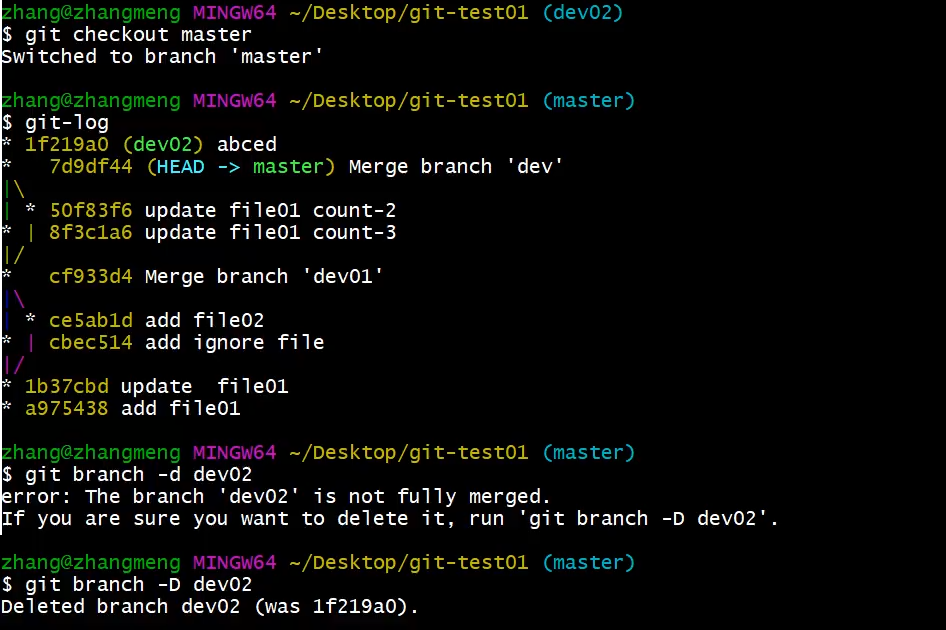

#### 3.4.8、解决冲突

当两个分支上对文件的修改可能会存在冲突，例如同时修改了同一个文件的同一行，这时就需要手动解决冲突，解决冲突步骤如下：

1. 处理文件中冲突的地方
2. 将解决完冲突的文件加入暂存区(add)
3. 提交到仓库(commit)

冲突部分的内容处理如下所示：

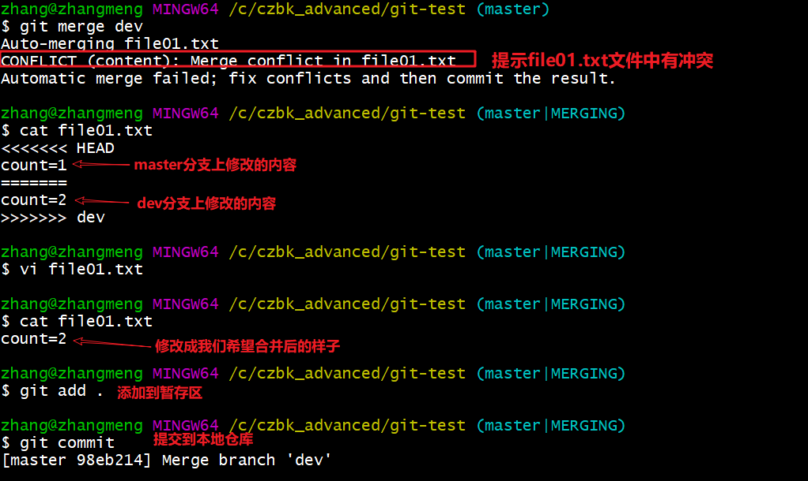

#### 3.4.9、开发中分支使用原则与流程

几乎所有的版本控制系统都以某种形式支持分支。 使用分支意味着你可以把你的工作从开发主线上分离开来进行重大的Bug修改、开发新的功能，以免影响开发主线。

在开发中，一般有如下分支使用原则与流程：

- master （生产） 分支
  线上分支，主分支，中小规模项目作为线上运行的应用对应的分支。
- develop（开发）分支
  是从master创建的分支，一般作为开发部门的主要开发分支，如果没有其他并行开发不同期上线要求，都可以在此版本进行开发，阶段开发完成后，需要是合并到master分支,准备上线。
- feature/xxxx分支
  从develop创建的分支，一般是同期并行开发，但不同期上线时创建的分支，分支上的研发任务完成后合并到develop分支。
- hotfix/xxxx分支，
  从master派生的分支，一般作为线上bug修复使用，修复完成后需要合并到master、test、develop分支。
- 还有一些其他分支，在此不再详述，例如test分支（用于代码测试）、pre分支（预上线分支）等等。
- 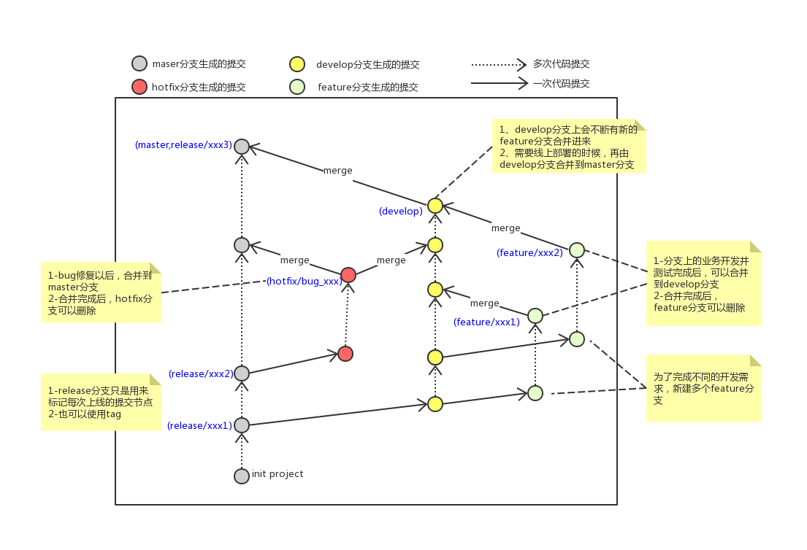

#### 练习:分支操作
```shell
###########################创建并切换到dev01分支，在dev01分支提交
# [master]创建分支dev01
git branch dev01
# [master]切换到dev01
git checkout dev01
# [dev01]创建文件file02.txt
略
# [dev01]将修改加入暂存区并提交到仓库,提交记录内容为：add file02 on dev
git add .
git commit -m 'add file02 on dev'
# [dev01]以精简的方式显示提交记录
git-log

###########################切换到master分支，将dev01合并到master分支
# [dev01]切换到master分支
git checkout master
# [master]合并dev01到master分支
git merge dev01
# [master]以精简的方式显示提交记录
git-log
# [master]查看文件变化(目录下也出现了file02.txt)
略

##########################删除dev01分支
# [master]删除dev01分支
git branch -d dev01
# [master]以精简的方式显示提交记录
git-log
```

## 4、Git远程仓库

### 4.1、 常用的托管服务[远程仓库]

```
前面我们已经知道了Git中存在两种类型的仓库，即本地仓库和远程仓库。那么我们如何搭建Git远程仓库呢？我们可以借助互联网上提供的一些代码托管服务来实现，其中比较常用的有GitHub、码云、GitLab等。
	gitHub（ 地址：https://github.com/ ）是一个面向开源及私有软件项目的托管平台，因为只支持Git 作为唯一的版本库格式进行托管，故名gitHub
	码云（地址： https://gitee.com/ ）是国内的一个代码托管平台，由于服务器在国内，所以相比于GitHub，码云速度会更快
	GitLab （地址： https://about.gitlab.com/ ）是一个用于仓库管理系统的开源项目，使用Git作为代码管理工具，并在此基础上搭建起来的web服务,一般用于在企业、学校等内部网络搭建git私服。
```

### 4.2、 注册码云

要想使用码云的相关服务，需要注册账号（地址： https://gitee.com/signup ）

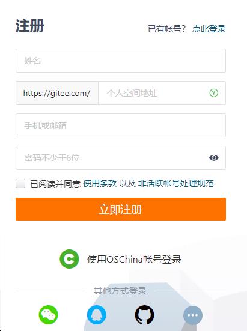

### 4.3、 创建远程仓库

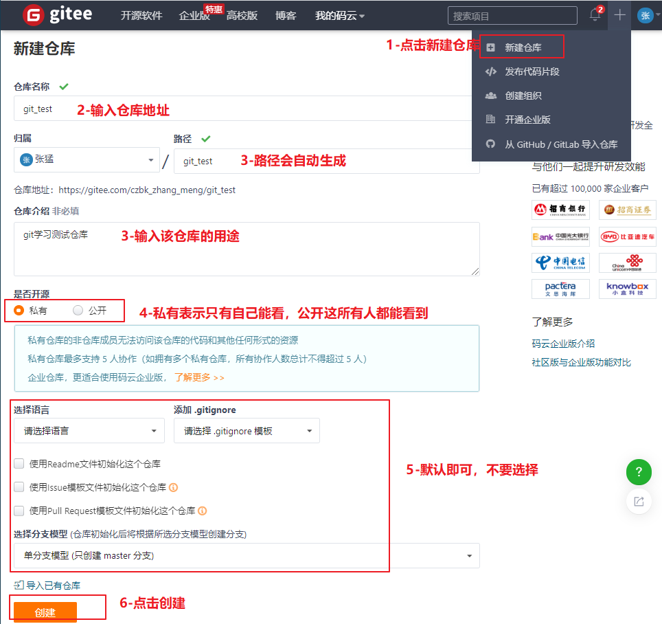

仓库创建完成后可以看到仓库地址，如下图所示:

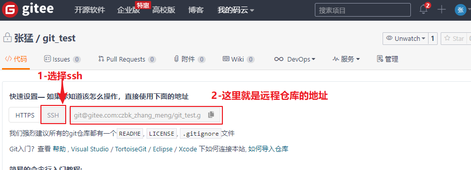

### 4.4、配置SSH公钥

- 生成SSH公钥
  - `ssh-keygen -t rsa`
  - 不断回车
    - 如果公钥已经存在，则自动覆盖
- Gitee设置账户共公钥
  - 获取公钥
    - `cat ~/.ssh/id_rsa.pub`
  - 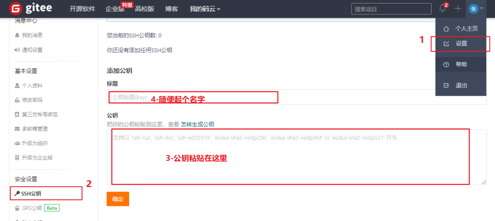
  - 验证是否配置成功
    - `ssh -T git@gitee.com`

### 4.5、操作远程仓库

#### 4.5.1、添加远程仓库

**此操作是先初始化本地库，然后与已创建的远程库进行对接。**

- 命令： `git remote add <远端名称> <仓库路径>`
  - 远端名称，默认是origin，取决于远端服务器设置
  - 仓库路径，从远端服务器获取此URL
  - 例如：
     `git remote add origin git@gitee.com:czbk_zhang_meng/git_test.git`
    

#### 4.5.2、查看远程仓库

- 命令：`git remote`
  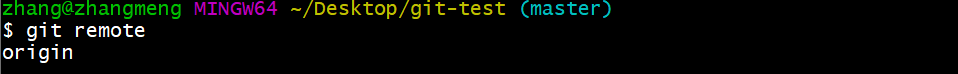

#### 4.5.3、推送到远程仓库

- 命令：`git push[ -f][ --set-upstream][ 远端名称[ 本地分支名[:远端分支名]]]`
  - 如果远程分支名和本地分支名称相同，则可以只写本地分支
    - `git push origin master`=`git push origin master:master`
      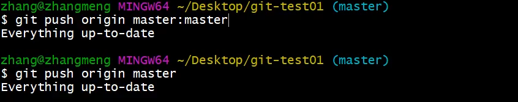
  - `-f` = `--force` 表示强制覆盖
  - `-u` = `--set-upstream` 推送到远端的同时并且建立起和远端分支的关联关系。
    - `git push --set-upstream origin master`
  - 如果**当前分支已经和远端分支关联**，则可以省略分支名和远端名。
    - `git push` 将master分支推送到已关联的远端分支。
      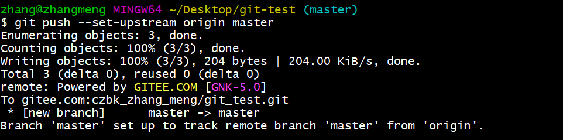

查询远程仓库

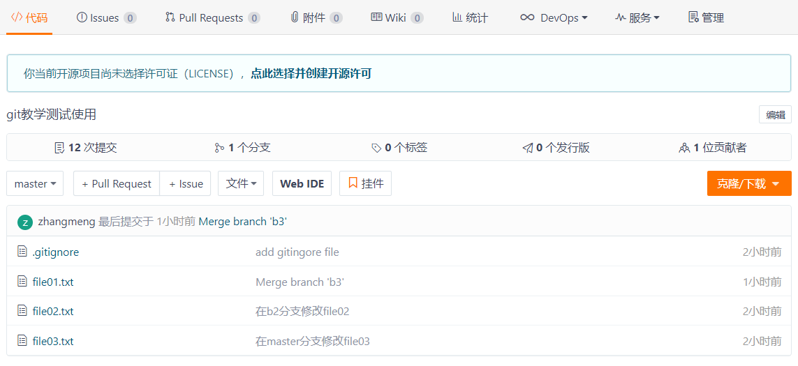

#### 4.5.4、 本地分支与远程分支的关联关系

- 查看关联关系我们可以使用 `git branch -vv` 命令

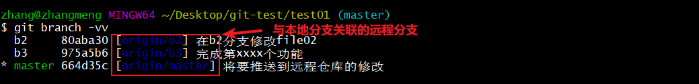

#### 4.5.5、从远程仓库克隆

如果已经有一个远端仓库，我们可以直接clone到本地。

- 命令: `git clone <仓库路径> [本地目录]`
  - 本地目录可以省略，会自动生成一个目录

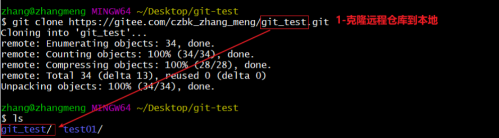

#### 4.5.6、从远程仓库中抓取和拉取

远程分支和本地的分支一样，我们可以进行merge操作，只是需要先把远端仓库里的更新都下载到本地，再进行操作。

- 抓取 命令：`git fetch [remote name] [branch name]`
  - **抓取指令就是将仓库里的更新都抓取到本地，不会进行合并**
  - 如果不指定远端名称和分支名，则抓取所有分支。
- 拉取 命令：`git pull [remote name] [branch name]`
  - **拉取指令就是将远端仓库的修改拉到本地并自动进行合并，等同于fetch+merge**
  - 如果不指定远端名称和分支名，则抓取所有并更新当前分支。

1. 在test01这个本地仓库进行一次提交并推送到远程仓库
   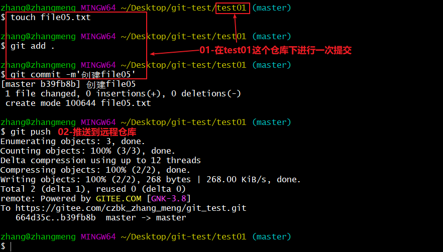
2. 在另一个仓库将远程提交的代码拉取到本地仓库
   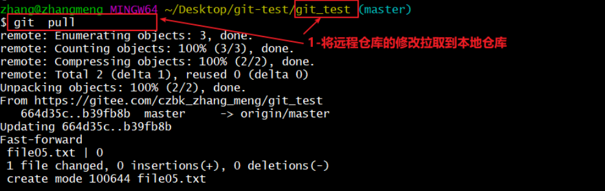

#### 4.5.7、解决合并冲突

在一段时间，A、B用户修改了同一个文件，且修改了同一行位置的代码，此时会发生合并冲突。

A用户在本地修改代码后优先推送到远程仓库，此时B用户在本地修订代码，提交到本地仓库后，也需要推送到远程仓库，此时B用户晚于A用户，**故需要先拉取远程仓库的提交，经过合并后才能推送到远端分支**，如下图所示。

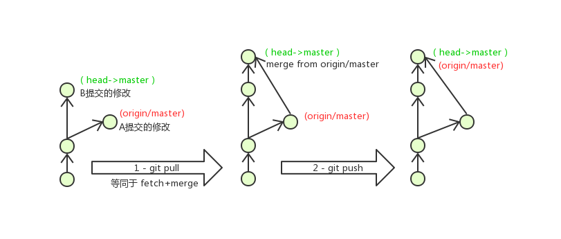

在B用户拉取代码时，因为A、B用户同一段时间修改了同一个文件的相同位置代码，故会发生合并冲突。

**远程分支也是分支，所以合并时冲突的解决方式也和解决本地分支冲突相同相同**，在此不再赘述，需要学员自己练习。

#### 练习:远程仓库操作

```shell
##########################1-将本地仓库推送到远程仓库
# 完成4.1、4.2、4.3、4.4的操作
略
# [git_test01]添加远程仓库
git remote add origin git@gitee.com/**/**.git
# [git_test01]将master分支推送到远程仓库,并与远程仓库的master分支绑定关联关系
git push --set-upstream origin master

###########################2-将远程仓库克隆到本地
# 将远程仓库克隆到本地git_test02目录下
git clone git@gitee.com/**/**.git git_test02
# [git_test02]以精简的方式显示提交记录
git-log

###########################3-将本地修改推送到远程仓库
# [git_test01]创建文件file03.txt
略
# [git_test01]将修改加入暂存区并提交到仓库,提交记录内容为：add file03
git add .
git commit -m 'add file03'
# [git_test01]将master分支的修改推送到远程仓库
git push origin master

###########################4-将远程仓库的修改更新到本地
# [git_test02]将远程仓库修改再拉取到本地
git pull
# 以精简的方式显示提交记录
git-log
# 查看文件变化(目录下也出现了file03.txt)
略
```

#### 移除远程仓库

- 命令：`git remote rm <remote-name>` = `git remote remove <remote-name>`

## 5、在Idea中使用Git

### 5.1、在Idea中配置Git

安装好IntelliJ IDEA后，如果Git安装在默认路径下，那么idea会自动找到git的位置，如果更改了Git的安装位置则需要手动配置下Git的路径。选择File→Settings打开设置窗口，找到Version Control下的git选项：

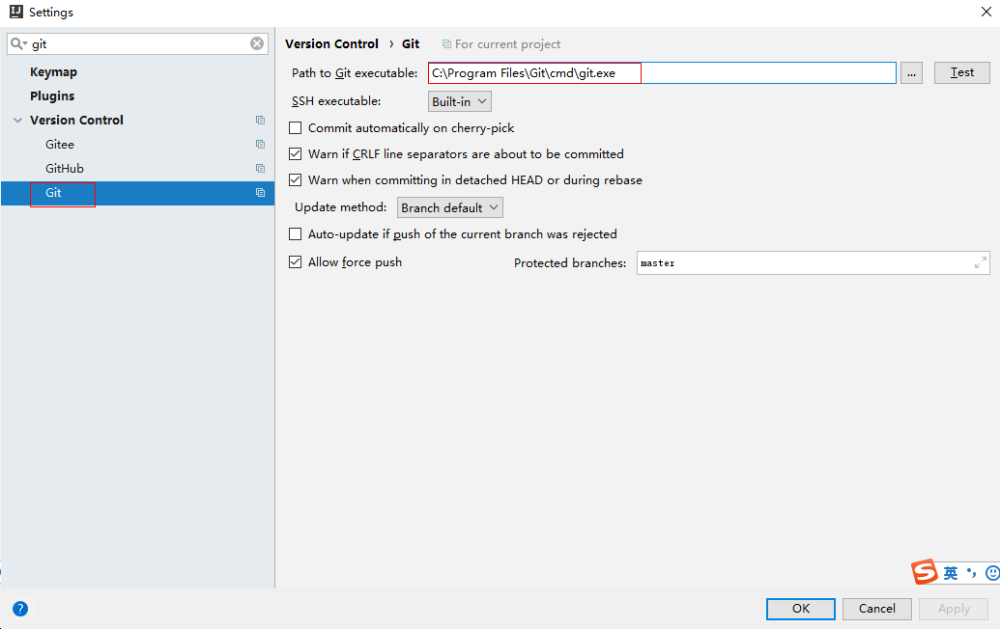

点击Test按钮,现在执行成功，配置完成

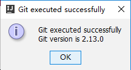

### 5.2、在Idea中操作Git

场景：本地已经有一个项目，但是并不是git项目，我们需要将这个放到码云的仓库里，和其他开发人员继续一起协作开发。

#### 5.2.1、创建项目远程仓库（参照4.3）

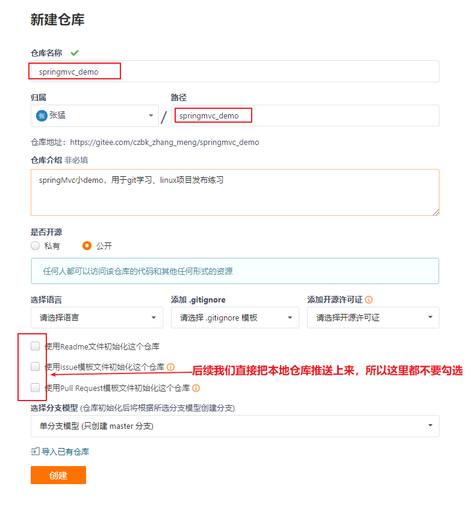

#### 5.2.2、初始化本地仓库

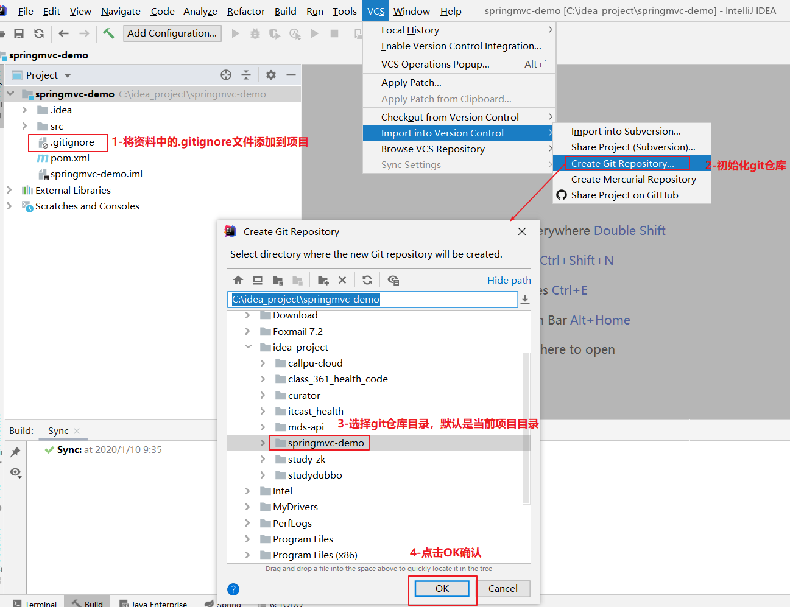

#### 5.2.3、设置远程仓库

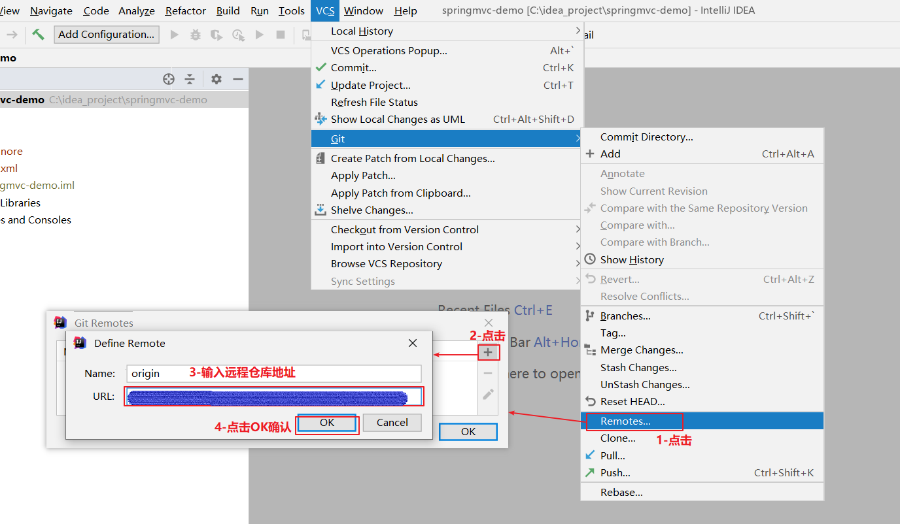

#### 5.2.4、提交到本地仓库

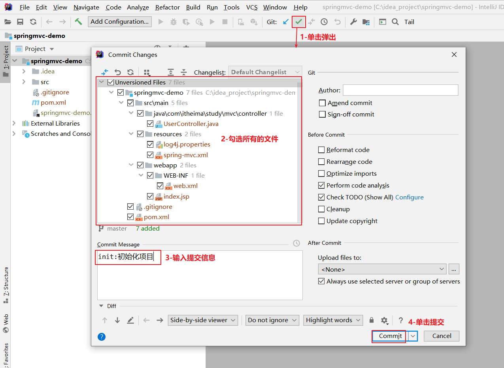

#### 5.2.6、推送到远程仓库

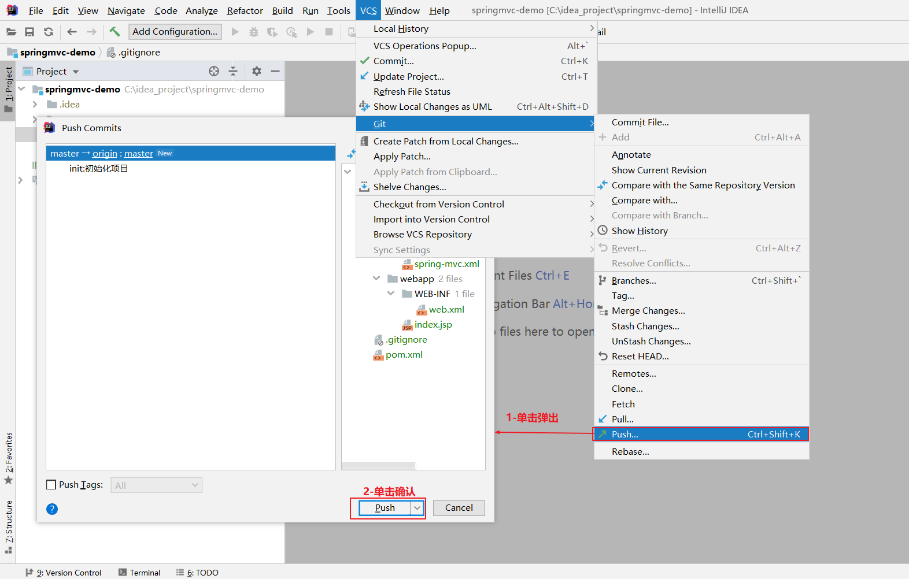

#### 5.2.7、克隆远程仓库到本地

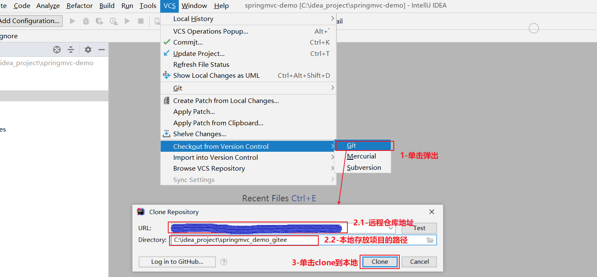

#### 5.2.8、创建分支

- 最常规的方式
  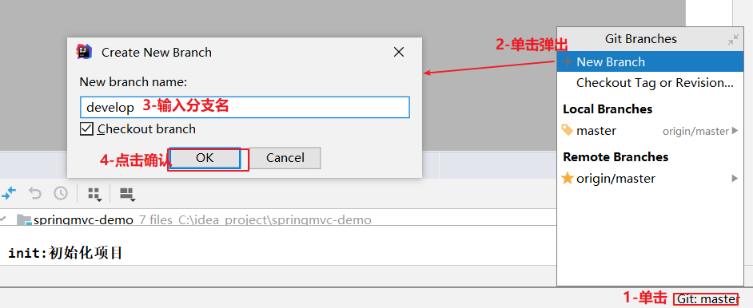
- 最强大的的方式
  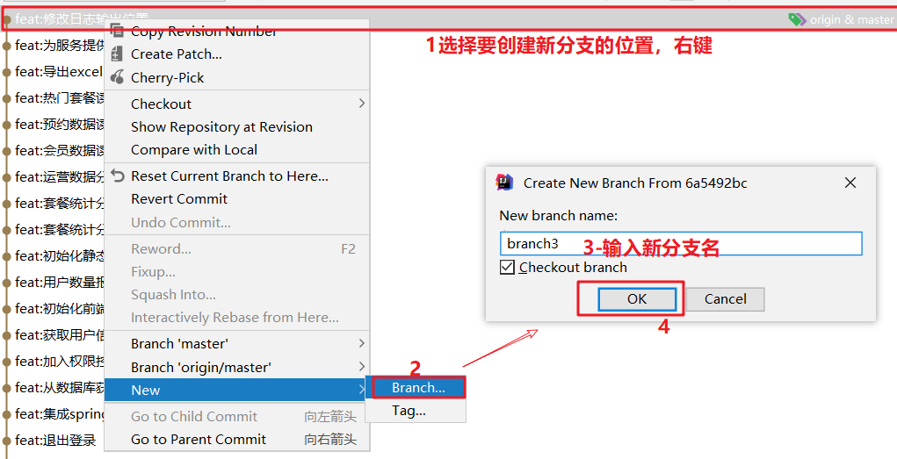

#### 5.2.9、切换分支及其他分支相关操作

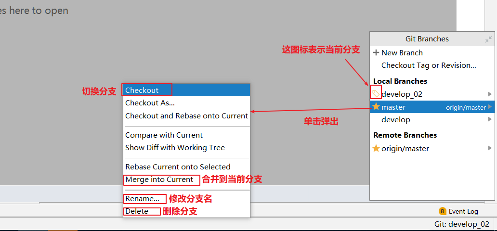

#### 5.2.11、解决冲突

1. 执行merge或pull操作时，可能发生冲突
     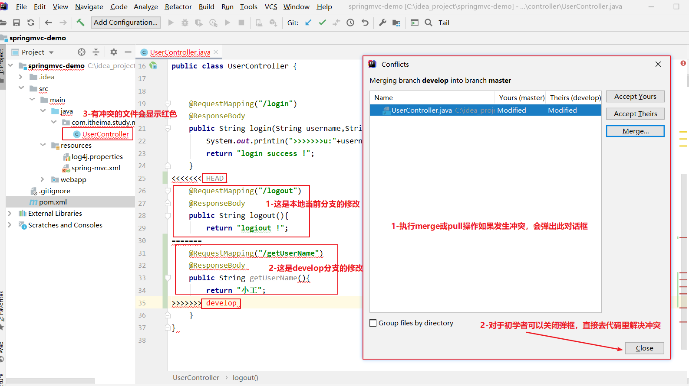
2. 冲突解决后加入暂存区
    略
3. 提交到本地仓库
    略
4. 推送到远程仓库
    略

### 5.3、IDEA常用GIT操作入口

1. 第一张图上的快捷入口可以基本满足开发的需求。
   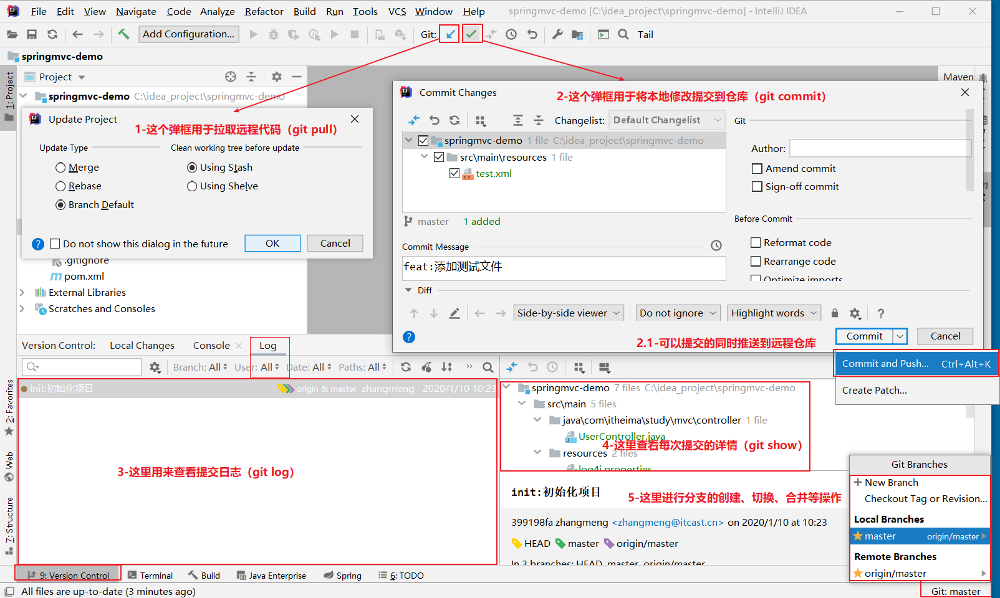
2. 第二张图是更多在IDEA操作git的入口。
   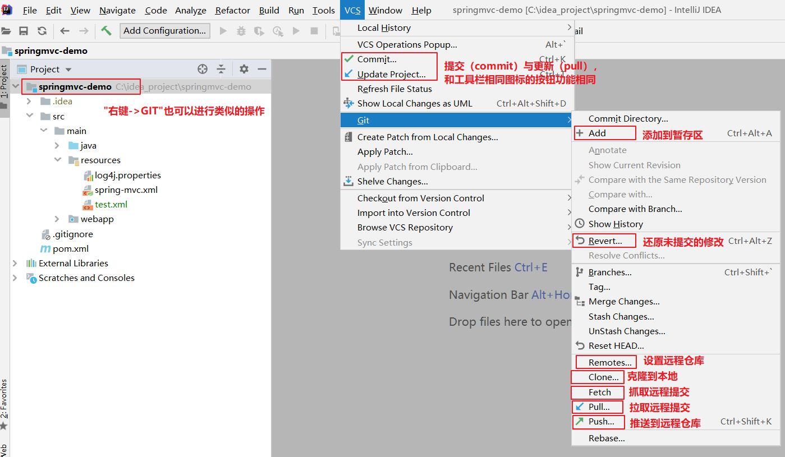

### 5.4、场景分析

基于我们后面的实战模式，我们做一个综合练习

当前的开发环境如下，我们每个人都对这个项目已经开发一段时间，接下来我们要切换成团队开发模
式。

也就是我们由一个团队来完成这个项目实战的内容。团队有组长和若干组员组成（组长就是开发中的项
目经理）。

所有操作都在idea中完成。

练习场景如下：

1. 由组长，基于本项目创建本地仓库；创建远程仓库，推送项目到远程仓库。
   
2. 每一位组员从远程仓库克隆项目到idea中,这样每位同学在自己电脑上就有了一个工作副本，可以正
   式的开始开发了。我们模拟两个组员(组员A、组员B)，克隆两个工作区。
   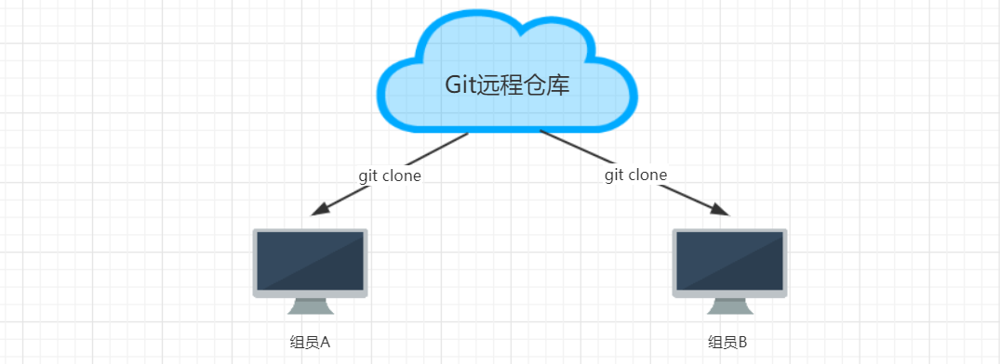
3. 组员A修改工作区,提交到本地仓库，再推送到远程仓库。组员B可以直接从远程仓库获取最新的代
   码。
   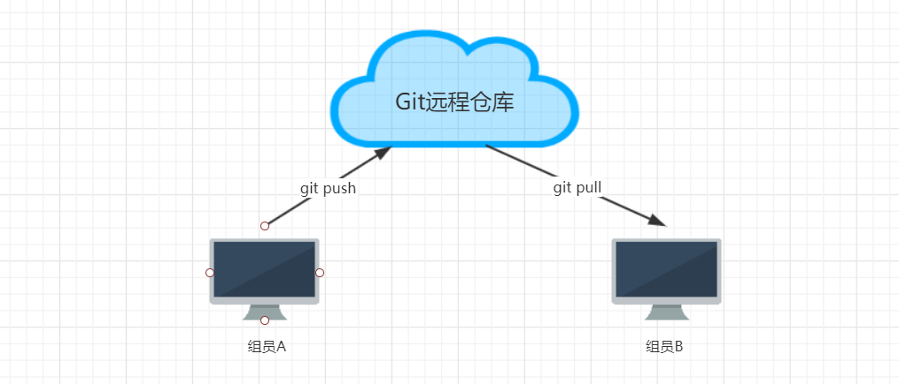
4. 组员A和组员B修改了同一个文件的同一行，提交到本地没有问题，但是推送到远程仓库时，后一个
   推送操作就会失败。
   解决方法：需要先获取远程仓库的代码到本地仓库，编辑冲突，提交并推送代码。
   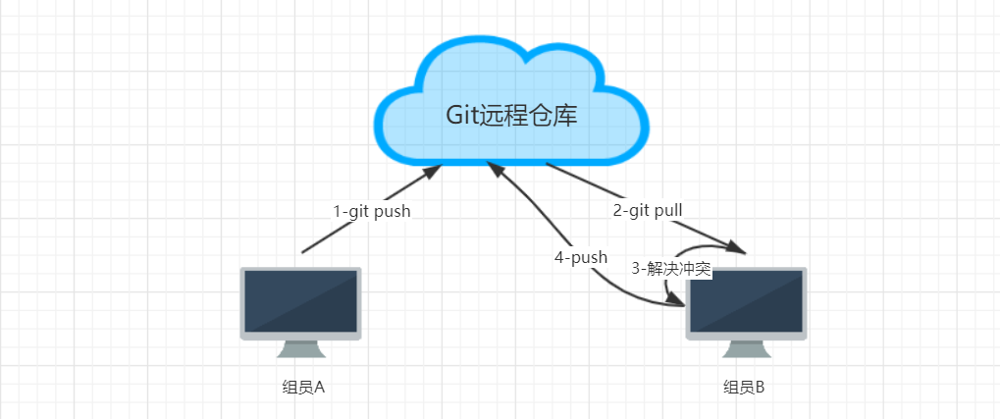

## 附:几条铁令

1. **切换分支前先提交本地的修改**
2. 代码及时提交，提交过了就不会丢
3. 遇到任何问题都不要删除文件目录，第1时间找老师

## 附:疑难问题解决

### 1. windows下看不到隐藏的文件（.bashrc、.gitignore）


### 2. windows下无法创建.ignore|.bashrc文件

这里以创建.ignore 文件为例：

- 在git目录下打开gitbash
- 执行指令`touch .gitignore`

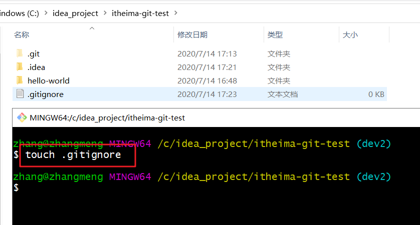

## 附：IDEA集成GitBash作为Terminal

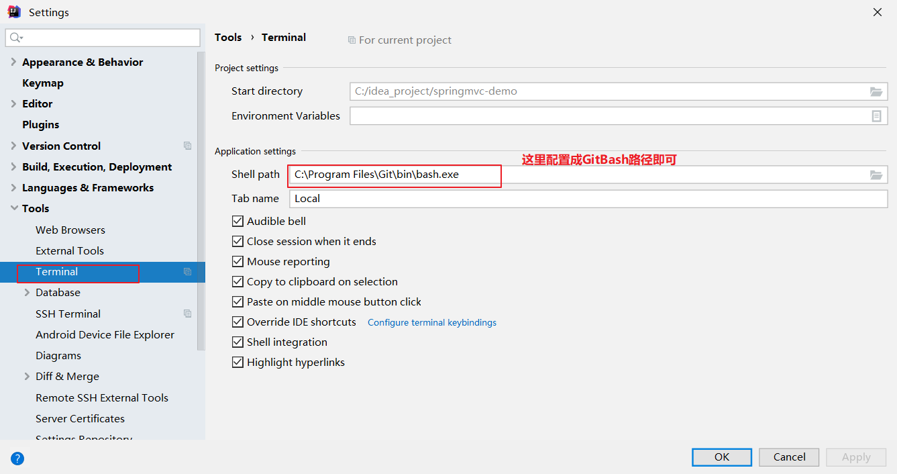